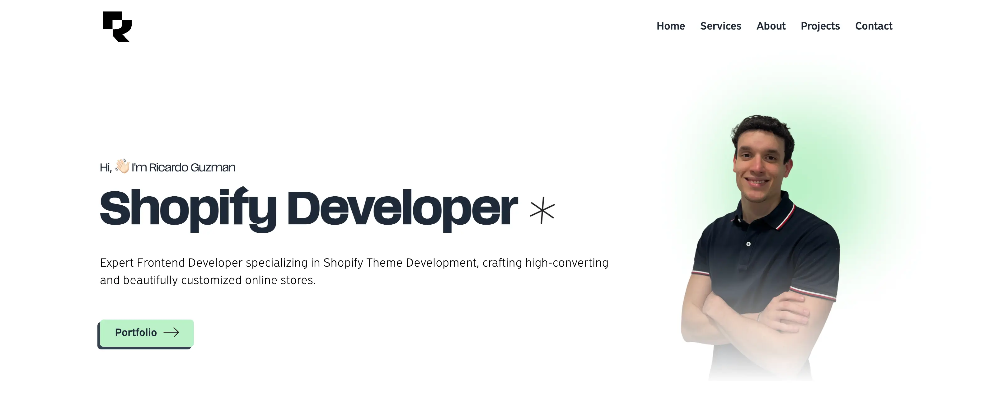

# My Personal Portfolio!

This is my personal portfolio in which I have showcased all my projects and blogs. I have also shared my resume and contact details.

## Features

It's a _one-page_ portfolio that shows the following sections:

- **Home:** This is the banner section basically showing my name, brief description and a personal photo.
- **Skills:** Since I'm a freelancer I though it would be a good idea to right away show the skills I have for potential customers
- **About Me:** A little bit about me and my journey so far.
- **Projects:** All the projects I have worked on so far.
- **Contact:** My contact details and a contact form for potential customers to reach out to me.

## Tech Stack

- Astro
- React Components inside Astro
- Tailwind CSS
